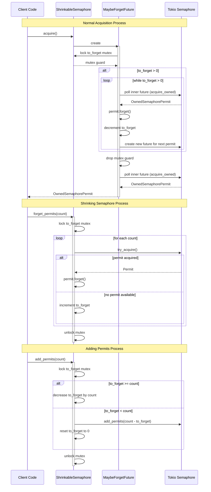

https://www.youtube.com/watch?v=CQvmSXlnyeQ&list=PLj6h78yzYM2O1wlsM-Ma-RYhfT5LKq0XC&index=22

https://github.com/vectordotdev/vector/blob/master/src/sinks/util/adaptive_concurrency/controller.rs

ShrinkableSemaphore 

