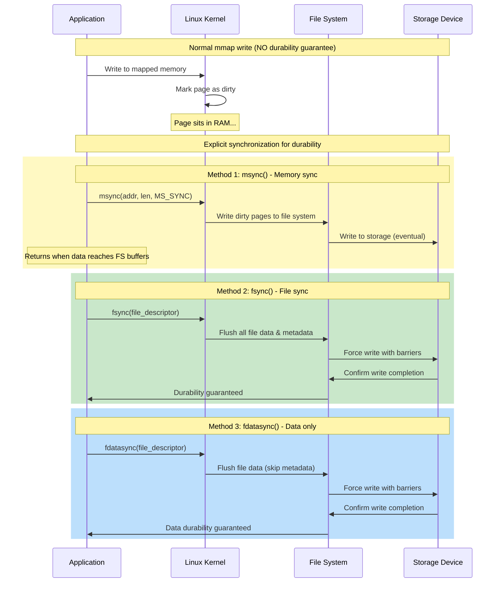

```mermaid
sequenceDiagram
    participant App as Application
    participant Kernel as Linux Kernel
    participant FS as File System
    participant Disk as Storage Device
    
    Note over App,Disk: Normal mmap write (NO durability guarantee)
    App->>Kernel: Write to mapped memory
    Kernel->>Kernel: Mark page as dirty
    Note over Kernel: Page sits in RAM...
    
    Note over App,Disk: Explicit synchronization for durability
    
    rect rgb(255, 235, 59, 0.3)
    Note over App,Disk: Method 1: msync() - Memory sync
    App->>Kernel: msync(addr, len, MS_SYNC)
    Kernel->>FS: Write dirty pages to file system
    FS->>Disk: Write to storage (eventual)
    Note over App: Returns when data reaches FS buffers
    end
    
    rect rgb(76, 175, 80, 0.3)
    Note over App,Disk: Method 2: fsync() - File sync
    App->>Kernel: fsync(file_descriptor)
    Kernel->>FS: Flush all file data & metadata
    FS->>Disk: Force write with barriers
    Disk->>FS: Confirm write completion
    FS->>App: Durability guaranteed
    end
    
    rect rgb(33, 150, 243, 0.3)
    Note over App,Disk: Method 3: fdatasync() - Data only
    App->>Kernel: fdatasync(file_descriptor)
    Kernel->>FS: Flush file data (skip metadata)
    FS->>Disk: Force write with barriers
    Disk->>FS: Confirm write completion
    FS->>App: Data durability guaranteed
    end
```
